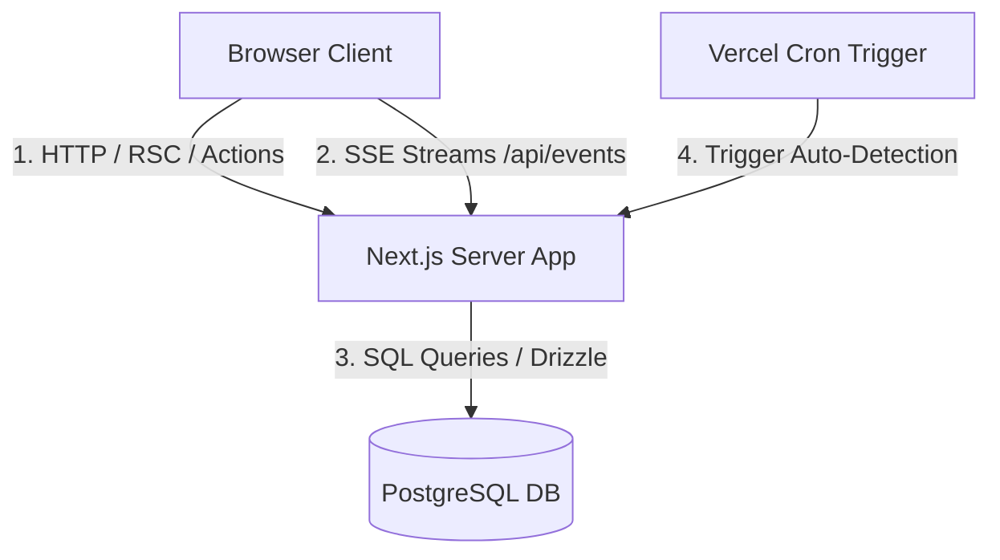
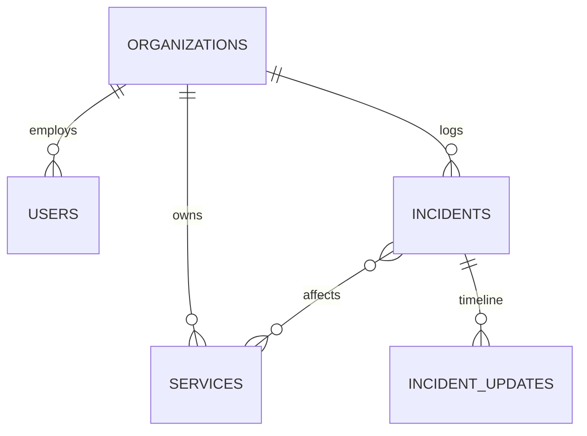

# System Architecture

This document provides a detailed overview of the technical design, database architecture, data flows, and engineering choices behind StatusForge.

---

## System Overview

StatusForge is designed to run in a self-hosted environment with minimal operational overhead. It is built as a unified Next.js application, integrating frontend client components, server actions, REST API endpoints, real-time push events, and automated database interactions into a single deployment unit.

---

## Database Architecture

StatusForge uses a relational PostgreSQL database model mapping 6 core tables. The schema is defined, validated, and pushed using **Drizzle ORM**.

### Table Schemas

#### 1. `organizations`
Represents the tenant instance.
- `id` (uuid, Primary Key)
- `name` (text, Not Null)
- `createdAt` (timestamp, Default now)

#### 2. `users`
Represents administrative dashboard managers.
- `id` (uuid, Primary Key)
- `orgId` (uuid, Foreign Key $\rightarrow$ `organizations.id`)
- `email` (text, Unique, Not Null)
- `passwordHash` (text, Not Null)
- `name` (text, Not Null)
- `role` (text, Default 'admin')
- `createdAt` (timestamp)

#### 3. `services`
Monitored system components.
- `id` (uuid, Primary Key)
- `orgId` (uuid, Foreign Key $\rightarrow$ `organizations.id`)
- `name` (text, Not Null)
- `description` (text)
- `status` (enum: `'operational'`, `'degraded'`, `'down'`, Default `'operational'`)
- `sortOrder` (integer, Not Null, default 0)
- `createdAt` (timestamp)

#### 4. `incidents`
Logged downtime events.
- `id` (uuid, Primary Key)
- `orgId` (uuid, Foreign Key $\rightarrow$ `organizations.id`)
- `title` (text, Not Null)
- `severity` (enum: `'minor'`, `'major'`, `'critical'`)
- `status` (enum: `'investigating'`, `'identified'`, `'monitoring'`, `'resolved'`)
- `createdAt` (timestamp)
- `resolvedAt` (timestamp)

#### 5. `incident_updates`
Timestamps details added during incident management.
- `id` (uuid, Primary Key)
- `incidentId` (uuid, Foreign Key $\rightarrow$ `incidents.id`)
- `message` (text, Not Null)
- `statusAtTime` (text, Not Null)
- `createdAt` (timestamp)

#### 6. `incident_services`
Many-to-many relationship mapping incidents to affected services.
- `incidentId` (uuid, Foreign Key $\rightarrow$ `incidents.id`)
- `serviceId` (uuid, Foreign Key $\rightarrow$ `services.id`)

---

## Key Technical Workflows

### 1. Real-Time Updates via Server-Sent Events (SSE)
To keep status page visitors synced without persistent AJAX polling, StatusForge implements a real-time event router over HTTP SSE:
- **Client Subscription:** The public status board establishes an `EventSource` connection at `/api/events`.
- **Global Broadcast Channel:** When an administrator toggles a service status or logs an incident update, a Server Event trigger publishes a lightweight JSON packet to the subscriber pool.
- **Client Render:** The client hook parses the message and transitions status dots or timelines instantly with visual animations.

### 2. Auto-Detection Cron Job
An automated scheduler flags unattended service failures:
- **Ping Loop:** A Vercel Cron Job triggers the `/api/cron/auto-detect` endpoint.
- **Evaluation:** The server scans all registered components for any service marked as `down` which lacks an open incident for more than 5 minutes.
- **Incident Generation:** It automatically generates a draft incident (e.g. *"Auto-Detected Outage: [Service Name] is Down"*) and pushes it to the public status timeline.

---

## Core Design Decisions

- **Single Deployment Artifact:** Bundling database query layers, auth logic, dashboard editors, and SSE broadcasters into Next.js simplifies self-hosting.
- **Unverified Session Cookies:** Iron-session stores encrypted, signed cookies on the client, removing the need for server-side state lookup.
- **Drizzle Kit Migration Model:** Schema updates are pushed declaratively via `drizzle-kit push` to avoid migration sync issues during local trials.
